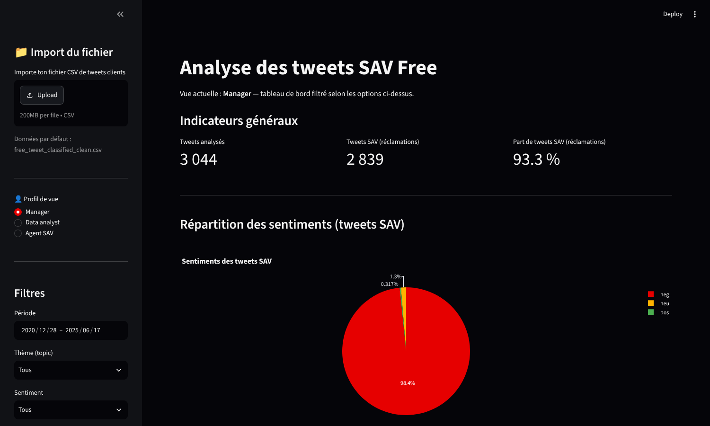
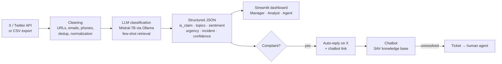
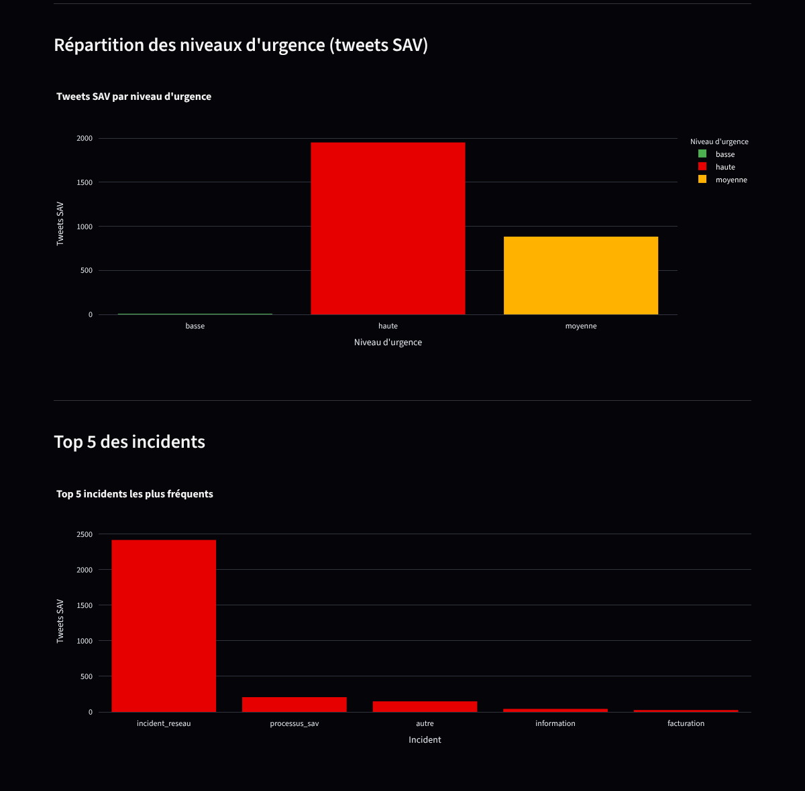
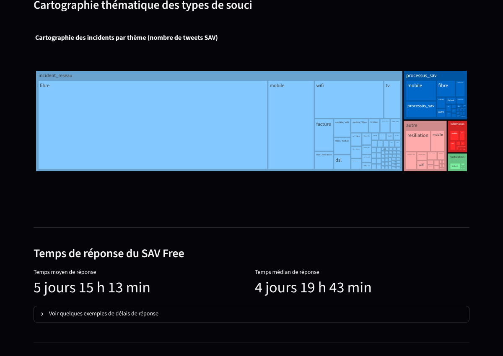
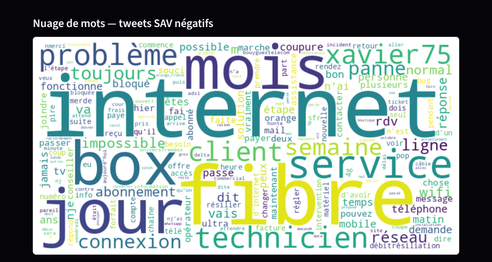

# 📡 Free Mobile – Automated Customer Complaint Analysis with LLMs

> Detect, classify and prioritize customer complaints posted on X (Twitter) using a local LLM (Mistral-7B), then turn them into actionable KPIs for customer service teams.


Master's capstone project (Master Data & AI, HETIC Paris), May – Nov. 2025, built by a team of 5 for the **Free Mobile** use case.



---

## 🎯 The problem

Free's customer service account on X is used by customers as an **emergency channel**: outages, fiber issues, billing problems… But answers come late.

| Key figure (dataset Dec. 2020 – June 2025) | Value |
|---|---|
| Tweets analyzed | **3,044** |
| Customer service complaints detected | **2,839 (93.3%)** |
| High-urgency complaints | **68.7%** |
| Negative sentiment among complaints | **98.4%** |
| Average response time of Free's customer service | **5 days 15 h** (median 4 days 19 h) |

**Goal:** automatically identify real complaints, understand what they are about and how urgent they are, and route them to the right answer (chatbot or human agent).

---

## 🏗️ Architecture



The whole flow is orchestrated with **n8n** (collection, cleaning, inference, storage, replies), with a **hybrid LLM setup**: Mistral via API in normal mode, and a local Mistral-7B with **Ollama** as a fallback during traffic peaks or API outages.

---

## 🧠 LLM classification

Each tweet is sent to Mistral-7B with a system prompt and few-shot examples ([`classification/prompt_tweets_free.txt`](classification/prompt_tweets_free.txt)). The model must answer with **one strict JSON line**:

```json
{"is_claim": 1, "topics": ["fibre"], "sentiment": "neg", "urgence": "haute", "incident": "incident_reseau", "confidence": 0.9}
```

- **Topics:** fibre, DSL, wifi, TV, mobile, billing, activation, cancellation, other (multi-label)
- **Incident types:** network incident, billing, delivery, information, customer service process, other
- **Robustness:** HTTP retries with backoff, tolerant JSON parsing, label normalization, error flag per row

---

## 🧪 Benchmark of prompting strategies

We compared 5 prompting strategies on a hand-annotated set of **300 tweets** (stratified split, test set of 30 tweets), measuring quality with scikit-learn (per-class F1, macro-F1) and performance with latency percentiles (p50 / p95) and token counts.

| Strategy | Macro-F1 | F1 neg / neu / pos | Prompt tokens |
|---|---|---|---|
| Few-shot 6 | 0.426 | 0.943 / 0.333 / 0.000 | 848 |
| Few-shot 12 | 0.480 | 0.941 / 0.500 / 0.000 | 1,449 |
| Few-shot 24 | 0.542 | 0.960 / 0.667 / 0.000 | 2,667 |
| System prompt + 3-shot | 0.511 | 0.962 / 0.571 / 0.000 | 1,004 |
| **Few-shot retrieval (k=12, MMR)** | **0.903** | **0.960 / 0.750 / 1.000** | 1,450 |

**Takeaways**
- Fixed few-shot examples never detected the rare **positive** class (9 / 300 tweets).
- **Semantic retrieval** (Sentence-Transformers `all-MiniLM-L6-v2` embeddings + **Maximal Marginal Relevance** to balance relevance and diversity) picks the most useful examples for each tweet and lifts macro-F1 from **0.54 to 0.90**, with a shorter prompt than the 24-shot version → retained for the POC.
- Trade-off: higher latency on a CPU laptop (embedding computation). Planned optimizations: embedding cache, FAISS index, GPU serving.

> ⚠️ The test set is small (30 tweets, 1 positive): these results validate the approach for a POC, not a production-grade model.

Scripts and raw outputs: [`benchmarks/`](benchmarks/).

---

## 📊 Dashboard

A Streamlit dashboard with **3 user profiles** (Manager, Data Analyst, Customer Service Agent) and filters by period, topic, sentiment, incident type and urgency.

| Urgency & top incidents | Themes & response time |
|---|---|
|  |  |



---

## 💡 Business recommendations

1. **Twitter chatbot** for simple requests (outage status, Freebox restart, line status): target response time **under 1 hour** vs 5 days today.
2. **Automatic prioritization** of urgent tweets with the LLM and routing to the right team.
3. **"Network crisis" task force** with extended hours: outages create massive peaks, often in the evening and at weekends.
4. **Real-time FAQ** built from the most frequent complaint topics (fiber, SIM, general outages).

---

## 🔒 Data privacy (GDPR)

The published datasets are **anonymized** with [`scripts/anonymize_data.py`](scripts/anonymize_data.py):
- tweet IDs replaced by salted hashes (joins between customer tweets and Free's replies still work);
- user handles, names, user IDs, profile pictures and URLs removed;
- mentions of private individuals replaced by `@user`, e-mails and phone numbers masked.

---

## 📁 Repository structure

```
free-customer-care-llm/
├── cleaning/            # Tweet cleaning notebook (URLs, HTML, hashtags, dedup)
├── classification/      # LLM classification notebook + system prompt
├── benchmarks/          # Prompting strategy evaluation scripts + results
├── dashboard/           # Streamlit app
├── data/                # Anonymized datasets
├── scripts/             # Data anonymization
└── docs/images/         # Screenshots
```

---

## ▶️ Run it locally

```bash
git clone https://github.com/Yassinech12/free-customer-care-llm.git
cd free-customer-care-llm
pip install -r requirements.txt

# Dashboard (loads the anonymized classified dataset by default)
streamlit run dashboard/app.py
```

To re-run the LLM classification, install [Ollama](https://ollama.com), pull the model and open the notebook:

```bash
ollama pull mistral
jupyter notebook classification/classification.ipynb
```

> The benchmark scripts expect the annotated split files (`data/test_split_full.csv`), which are not included in this repository.

---

## 👥 Team & contributions

| Member | Role | Main contributions |
|---|---|---|
| **Mohamed Yassine CHARIT** | Business Analyst / Product Owner | Product vision and backlog, **LLM classification of the full dataset** (notebook + prompt), **Streamlit dashboard**, system-prompt + 3-shot benchmark, data analysis and business recommendations |
| Mohammed Taha OUAAZZI | Project Manager | Planning, coordination, Scrum ceremonies |
| Kouassi Anderson EHOUSSOU | Solution Architect | Technical architecture, Mistral-7B integration |
| Houssam NAJIH | AI & Data Expert | Data collection and cleaning, FastAPI, n8n integration |
| Hamza AJERMOUN | Lead Developer | LLM benchmarks (few-shot, retrieval), infrastructure |

Original team repository: [Houssam-Najih/X_Automation_Project](https://github.com/Houssam-Najih/X_Automation_Project)

**Methodology:** Agile Scrum (2-week sprints) · Trello · GitHub · Notion · Microsoft Teams

---

📫 **Contact:** [LinkedIn](https://www.linkedin.com/in/yassine-charit/) · Yassine12charit@gmail.com
